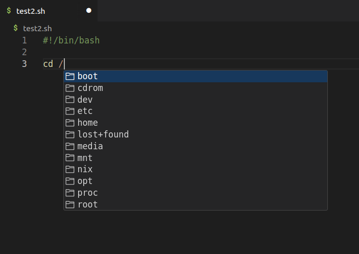
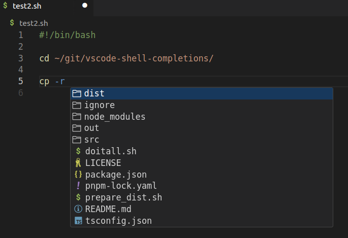
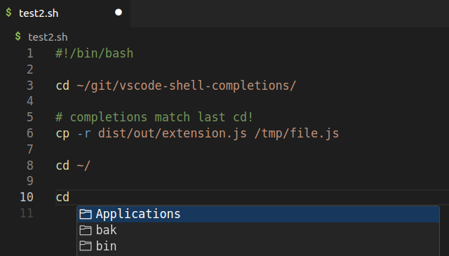

# vscode-shell-completions

vscode extension to tab-complete (intellisense) filenames in shell scripts. based on last 'cd' command before cursor.







For example, if you are editing script.sh:

```sh
cd ~/git/vscode-shell-completions
cat R # hit tab here and see README.md etc
```

It is based on last cd command before the line where your cursor is.

Thats it.
